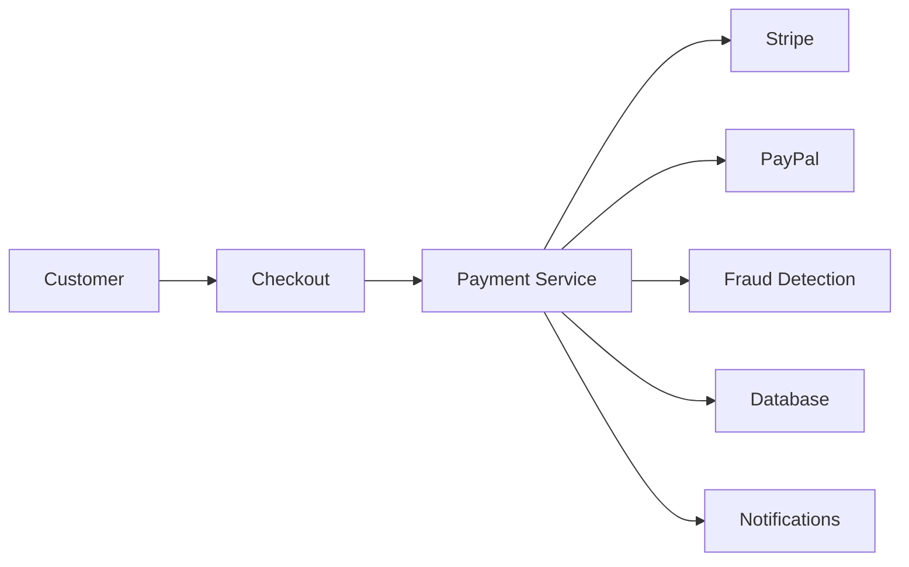

# Software Requirements Specification: Payment Processing System

---
**Document ID**: SRS-PAYMENT-001
**Version**: 1.0.0
**Date**: 2025-01-15
**Author**: Product Team
**Status**: Approved
**Classification**: High-Risk, Compliance-Critical

TOKEN_BUDGET: 1200
TIER: 3 (Example)
LOAD_TRIGGER: Few-shot example for SRS creation
---

## 1. Introduction

### 1.1 Purpose

This Software Requirements Specification (SRS) defines the functional and non-functional requirements for the Payment Processing System, a PCI-DSS compliant payment gateway for e-commerce transactions.

**Audience**: Developers, QA engineers, project managers, compliance auditors

### 1.2 Scope

The Payment Processing System will:
- Process credit card, debit card, and digital wallet payments
- Integrate with third-party payment providers (Stripe, PayPal)
- Handle payment authorization, capture, and refunds
- Store tokenized payment information securely
- Generate transaction reports and analytics

**Out of Scope**:
- Cryptocurrency payments
- Point-of-sale (POS) terminal integration
- Buy Now Pay Later (BNPL) services

### 1.3 Definitions and Acronyms

| Term | Definition |
|------|------------|
| **PCI-DSS** | Payment Card Industry Data Security Standard |
| **Tokenization** | Replacing sensitive card data with non-sensitive tokens |
| **3DS** | 3D Secure, an authentication protocol for online payments |
| **CVV** | Card Verification Value |
| **Authorization** | Reserving funds on a customer's card |
| **Capture** | Transferring authorized funds to merchant account |

### 1.4 References

- IEEE Std 830-1998 (Software Requirements Specification)
- PCI-DSS v4.0 Requirements
- Stripe API Documentation v2023-10-16
- GDPR Article 32 (Security of Processing)

---

## 2. Overall Description

### 2.1 Product Perspective

The Payment Processing System is a backend microservice that integrates with:
- **E-commerce Platform**: Receives payment requests from checkout flow
- **Payment Providers**: Stripe (primary), PayPal (secondary)
- **Fraud Detection Service**: Kount for transaction risk scoring
- **Accounting System**: SAP for revenue recognition
- **Notification Service**: Sends payment confirmations via email/SMS

### 2.2 Product Functions



### 2.3 User Classes and Characteristics

| User Class | Characteristics | Technical Expertise |
|------------|----------------|---------------------|
| **End Customers** | Online shoppers making purchases | Low |
| **Merchants** | E-commerce store owners monitoring transactions | Medium |
| **Support Agents** | Handle payment disputes and refunds | Medium |
| **System Admins** | Configure payment providers and rules | High |
| **Auditors** | Review PCI-DSS compliance | High |

### 2.4 Operating Environment

- **Backend**: Node.js 20 LTS, Express.js
- **Database**: PostgreSQL 15 (primary), Redis 7 (caching)
- **Infrastructure**: AWS (ECS Fargate, RDS, ElastiCache)
- **Payment Providers**: Stripe API v2023-10-16, PayPal REST API v2
- **Compliance**: PCI-DSS SAQ D (Merchant Level 1)

### 2.5 Design and Implementation Constraints

- **PCI-DSS Compliance**: No storage of CVV or full card numbers
- **Regulatory**: GDPR (EU), CCPA (California), PSD2 (Strong Customer Authentication)
- **Performance**: 99.95% uptime SLA
- **Security**: TLS 1.3, encrypted data at rest (AES-256)

---

## 3. System Features

### 3.1 Payment Authorization

**Priority**: Must-Have
**Risk**: High

#### 3.1.1 Description

Authorize a payment amount on a customer's payment method without capturing funds.

#### 3.1.2 Functional Requirements

**FR-PAY-001**: The system shall accept payment authorization requests with the following parameters:
- Amount (decimal, 2 decimal places)
- Currency (ISO 4217 code)
- Payment method (card, PayPal, Apple Pay)
- Customer ID (UUID)
- Order ID (alphanumeric)

**Acceptance Criteria**:
```gherkin
Given a customer has a valid credit card
When they submit an order for $99.99 USD
Then the system shall authorize $99.99 on their card
And return an authorization ID within 3 seconds
And reserve the funds for 7 days
```

**FR-PAY-002**: The system shall validate payment methods before authorization:
- Card number checksum (Luhn algorithm)
- Expiration date (must be future date)
- CVV (3-4 digits)
- Billing ZIP code

**FR-PAY-003**: The system shall implement 3D Secure (3DS) for transactions:
- EU transactions >€30
- Flagged high-risk transactions
- Customer-requested authentication

**FR-PAY-004**: The system shall return authorization results:
- **Success**: Authorization ID, authorized amount, expiration timestamp
- **Failure**: Error code, user-friendly message, retry flag

#### 3.1.3 Test Cases

| Test ID | Scenario | Expected Result |
|---------|----------|-----------------|
| TC-PAY-001 | Valid card, sufficient funds | Authorization approved |
| TC-PAY-002 | Invalid card number (Luhn check fail) | Authorization rejected, error code INVALID_CARD |
| TC-PAY-003 | Expired card | Authorization rejected, error code EXPIRED_CARD |
| TC-PAY-004 | Insufficient funds | Authorization declined, error code INSUFFICIENT_FUNDS |
| TC-PAY-005 | 3DS required, customer completes auth | Authorization approved after 3DS |
| TC-PAY-006 | 3DS required, customer cancels | Authorization rejected, error code 3DS_FAILED |

---

### 3.2 Payment Capture

**Priority**: Must-Have
**Risk**: High

#### 3.2.1 Description

Capture previously authorized funds and transfer to merchant account.

#### 3.2.2 Functional Requirements

**FR-PAY-010**: The system shall capture authorized payments:
- Capture full amount (default)
- Capture partial amount (e.g., $50 of $100 authorization)
- Capture within authorization window (7 days)

**FR-PAY-011**: The system shall prevent double captures:
- Track capture status (pending, captured, failed)
- Idempotency keys for duplicate requests
- Maximum one capture per authorization

**FR-PAY-012**: The system shall support delayed capture:
- Orders not yet shipped (authorize now, capture on shipment)
- Manual review (fraud check before capture)
- Configurable auto-capture window (24-168 hours)

---

### 3.3 Refund Processing

**Priority**: Must-Have
**Risk**: Medium

#### 3.3.1 Functional Requirements

**FR-PAY-020**: The system shall process refunds:
- Full refunds (100% of captured amount)
- Partial refunds (e.g., $30 of $100 order)
- Multiple partial refunds (up to total captured amount)
- Refund window: 180 days from capture

**FR-PAY-021**: The system shall track refund reasons:
- Customer requested (voluntary)
- Defective product
- Order not received
- Duplicate charge
- Fraudulent transaction

**FR-PAY-022**: The system shall notify stakeholders:
- Customer: Email confirmation with refund timeline
- Merchant: Refund deducted from payout
- Accounting: Refund journal entry

---

### 3.4 Tokenization

**Priority**: Must-Have
**Risk**: Critical (PCI-DSS)

#### 3.4.1 Functional Requirements

**FR-PAY-030**: The system shall tokenize sensitive card data:
- Replace PAN (Primary Account Number) with token
- Store token in database (not card number)
- Tokens are single-use or reusable (customer preference)

**FR-PAY-031**: The system shall NOT store:
- Full card numbers (only last 4 digits)
- CVV (Card Verification Value)
- Magnetic stripe data

**FR-PAY-032**: The system shall use provider tokenization:
- Stripe: PaymentMethod tokens
- PayPal: Billing agreements
- Tokens stored with customer profile for future payments

---

## 4. External Interface Requirements

### 4.1 User Interfaces

**UI-001**: The system shall NOT provide a customer-facing UI (handled by e-commerce platform)

**UI-002**: The system shall provide an Admin Dashboard for:
- Transaction search and filtering
- Refund approval workflow
- Payment provider configuration
- Reporting and analytics

### 4.2 Hardware Interfaces

Not applicable (cloud-native, no hardware dependencies)

### 4.3 Software Interfaces

**SI-001**: Stripe API Integration
- **Interface**: REST API over HTTPS
- **Endpoint**: `https://api.stripe.com/v1/`
- **Authentication**: Bearer token (secret key)
- **Data Format**: JSON
- **Operations**: Create PaymentIntent, Confirm Payment, Create Refund

**SI-002**: PayPal REST API Integration
- **Interface**: REST API over HTTPS
- **Endpoint**: `https://api.paypal.com/v2/`
- **Authentication**: OAuth 2.0
- **Data Format**: JSON
- **Operations**: Create Order, Authorize Payment, Capture Payment

**SI-003**: Fraud Detection Service (Kount)
- **Interface**: REST API over HTTPS
- **Data Sent**: Transaction amount, customer IP, email, device fingerprint
- **Data Received**: Risk score (0-100), recommendation (approve, review, decline)

### 4.4 Communication Interfaces

**CI-001**: All external communications shall use TLS 1.3
**CI-002**: Webhook endpoints shall validate signatures (HMAC-SHA256)
**CI-003**: API rate limits: 1000 requests/minute per merchant

---

## 5. Non-Functional Requirements

### 5.1 Performance Requirements

**NFR-PERF-001**: Payment authorization shall complete within 3 seconds (p95)
**NFR-PERF-002**: System shall handle 1000 transactions per second (peak load)
**NFR-PERF-003**: Database queries shall complete within 100ms (p95)

### 5.2 Safety Requirements

**NFR-SAFE-001**: Payment data loss tolerance: Zero (mission-critical)
**NFR-SAFE-002**: Automated backups: Every 15 minutes, retained for 30 days
**NFR-SAFE-003**: Disaster recovery: RPO <15 minutes, RTO <1 hour

### 5.3 Security Requirements

**NFR-SEC-001**: Data encryption at rest: AES-256
**NFR-SEC-002**: Data encryption in transit: TLS 1.3
**NFR-SEC-003**: Password storage: bcrypt with cost factor 12
**NFR-SEC-004**: API authentication: OAuth 2.0 + API keys
**NFR-SEC-005**: PCI-DSS compliance: Annual audit (SAQ D)
**NFR-SEC-006**: Penetration testing: Quarterly by third-party

### 5.4 Software Quality Attributes

**Availability**:
- **NFR-AVAIL-001**: 99.95% uptime (4.38 hours downtime/year)
- **NFR-AVAIL-002**: Planned maintenance windows: Off-peak hours only

**Maintainability**:
- **NFR-MAINT-001**: Code coverage: >80% (unit + integration tests)
- **NFR-MAINT-002**: Deployment frequency: On-demand, zero-downtime

**Scalability**:
- **NFR-SCALE-001**: Horizontal scaling: Auto-scale based on CPU >70%
- **NFR-SCALE-002**: Database connection pooling: Max 100 connections per instance

**Reliability**:
- **NFR-REL-001**: Payment success rate: >99.5% (excluding declined cards)
- **NFR-REL-002**: Idempotency: All payment operations idempotent (24-hour window)

---

## 6. Other Requirements

### 6.1 Compliance Requirements

**COMP-001**: PCI-DSS v4.0 compliance (Merchant Level 1)
**COMP-002**: GDPR compliance (data retention, right to erasure)
**COMP-003**: PSD2 Strong Customer Authentication (EU transactions)
**COMP-004**: SOC 2 Type II certification (annual audit)

### 6.2 Logging and Monitoring

**LOG-001**: All payment events logged: Authorization, capture, refund, failure
**LOG-002**: Structured logging: JSON format with correlation IDs
**LOG-003**: Log retention: 7 years (financial regulations)
**LOG-004**: Sensitive data masking: Card numbers (last 4 digits only), CVV (never logged)

**MON-001**: Real-time monitoring: Payment success rate, latency, error rate
**MON-002**: Alerting: PagerDuty for critical failures (success rate <95%)
**MON-003**: Dashboards: Grafana for transaction volume, revenue, errors

---

## Appendix A: Glossary

| Term | Definition |
|------|------------|
| **Authorization** | Reserving funds on a customer's payment method |
| **Capture** | Transferring authorized funds to merchant account |
| **Chargeback** | Customer-initiated reversal of a payment |
| **Merchant** | Business selling goods/services online |
| **Payment Gateway** | Service that authorizes payments |
| **Tokenization** | Replacing sensitive data with non-sensitive tokens |

---

## Appendix B: Requirements Traceability Matrix

| Req ID | Description | Design Component | Test Case | Priority | Status |
|--------|-------------|------------------|-----------|----------|--------|
| FR-PAY-001 | Accept authorization requests | PaymentController | TC-PAY-001 | Must | ✅ Done |
| FR-PAY-002 | Validate payment methods | ValidationService | TC-PAY-002 | Must | ✅ Done |
| FR-PAY-003 | Implement 3D Secure | ThreeDSService | TC-PAY-005 | Must | ⏳ In Progress |
| FR-PAY-010 | Capture payments | CaptureService | TC-PAY-010 | Must | 📋 Planned |

---

**End of SRS Example - Payment Processing System**
