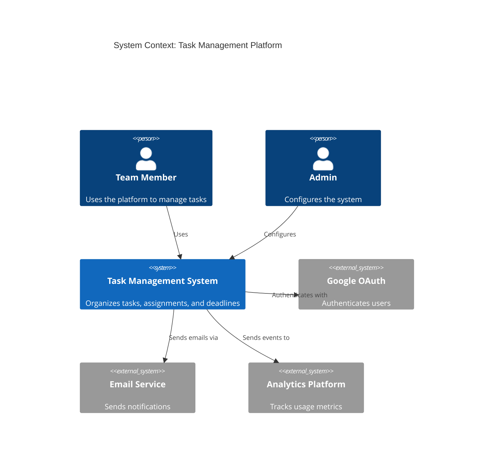

# Requirements: Traceability and Context

---
TOKEN_BUDGET: 200
TIER: 3
LOAD_TRIGGER: On-demand when creating traceability matrices or system context diagrams
DEPENDENCIES: 02-requirements-writing.md
---

## 2.3 Requirements Traceability

Every requirement should link to:
- **Source**: User need or business goal
- **Design**: Component that implements it
- **Test**: Test case that verifies it

### Requirements Traceability Matrix

| Req ID | Description | Design Component | Test Case | Priority | Status |
|--------|-------------|------------------|-----------|----------|--------|
| FR-001 | User login | AuthController | TC-001 | Must | ✅ Done |
| FR-002 | Create task | TaskService | TC-005 | Must | ⏳ In Progress |
| NFR-001 | Response < 500ms | Redis cache | TC-050 | Should | 📋 Planned |

## 2.4 System Context Diagrams

A **System Context Diagram** (C4 Level 1 or DFD Level 0) defines the system boundary:

**Purpose**: Shows what's inside vs. outside the system, clarifying scope and dependencies.

---

**End of Requirements Traceability Guide**
