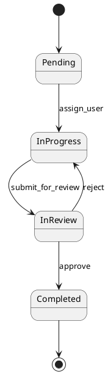
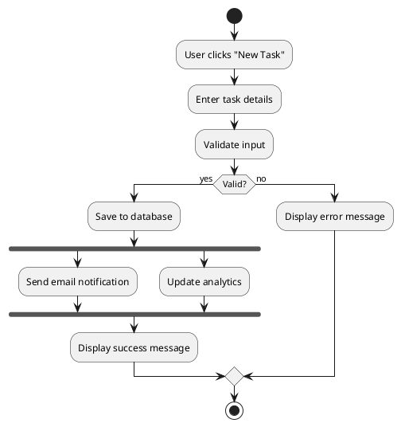

# Diagrams: State Machine vs. Activity Diagram

---
TOKEN_BUDGET: 350
TIER: 3
LOAD_TRIGGER: On-demand when choosing between state machine and activity diagrams
DEPENDENCIES: 04-diagrams-selection.md
---

## 4.2 State Machine vs. Activity Diagram

### State Machine Diagram

**Purpose**: Model the **states** of a single object and **event-driven transitions**

**Focus**: Object behavior based on its current state

**Key Elements**: States (circles), Events (triggers), Transitions (arrows)

**Use When**: System behavior changes based on state (e.g., Order: Pending → Processing → Shipped)

**Example: Task Lifecycle**

**Characteristics:**
- Event-driven (waits for events to trigger transitions)
- Models a single object's lifecycle
- Shows what states are valid and invalid transitions

---

### Activity Diagram

**Purpose**: Model **workflows, processes, or algorithms**

**Focus**: Flow of activities with decisions and parallelism

**Key Elements**: Activities (rectangles), Decisions (diamonds), Forks/Joins (bars)

**Use When**: Showing business processes with parallel steps (e.g., user registration flow)

**Example: Task Creation Workflow**

**Characteristics:**
- Action-driven (flows automatically from step to step)
- Models processes or algorithms
- Shows parallel execution with forks/joins

---

### Key Difference

**State diagrams wait for events; activity diagrams flow automatically.**

### Decision Guide

| Question | State Machine | Activity Diagram |
|----------|---------------|------------------|
| Am I modeling an object's lifecycle? | ✅ Yes | ❌ No |
| Does behavior depend on current state? | ✅ Yes | ❌ No |
| Am I showing a workflow with steps? | ❌ No | ✅ Yes |
| Do steps execute in parallel? | ❌ No | ✅ Yes |
| Is it event-driven? | ✅ Yes | ❌ No |

---

**End of State Machine vs. Activity Diagram Guide**
