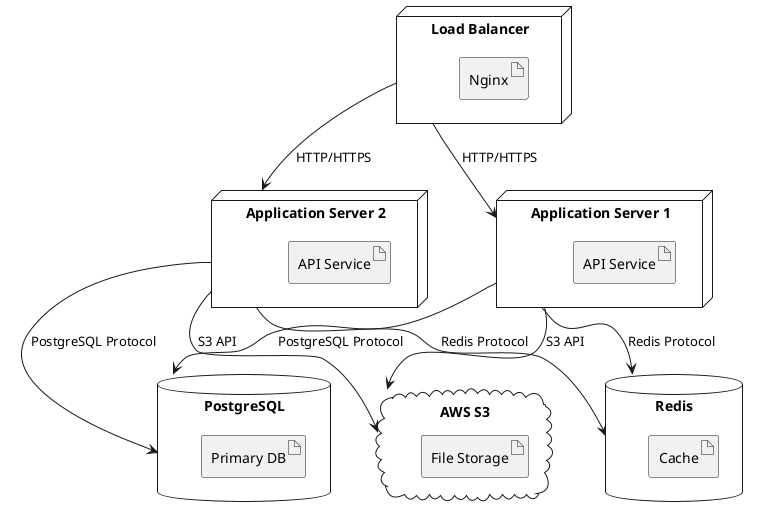

# Deployment: Diagrams

---
TOKEN_BUDGET: 250
TIER: 3
LOAD_TRIGGER: On-demand when creating deployment diagrams
DEPENDENCIES: 04-diagrams-selection.md, 06-deployment-documentation.md
---

## 6.2 Deployment Diagrams

**UML Deployment Diagram:**
- Shows physical infrastructure
- Maps software to hardware
- Displays network topology

### Example (PlantUML)

### What to Show

**Infrastructure Nodes:**
- Servers (physical or virtual)
- Containers (Docker, Kubernetes pods)
- Databases
- Caches
- Message queues
- Load balancers
- CDNs
- Cloud services (S3, SQS, etc.)

**Connections:**
- Protocols (HTTP, PostgreSQL, Redis)
- Ports (8080, 5432, 6379)
- Security (TLS/SSL)

**Deployment Units:**
- Artifacts (JARs, Docker images)
- Configuration files
- Static assets

### Use Cases

**Use deployment diagrams for:**
1. **Onboarding**: Help new engineers understand infrastructure
2. **Incident Response**: Visualize dependencies during outages
3. **Capacity Planning**: Identify bottlenecks and scaling opportunities
4. **Security Reviews**: Show attack surface and trust boundaries
5. **Compliance**: Document data flows for audits

---

**End of Deployment Diagrams Guide**
