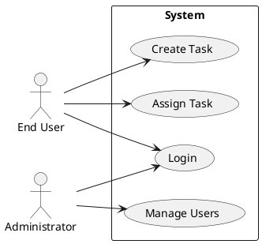
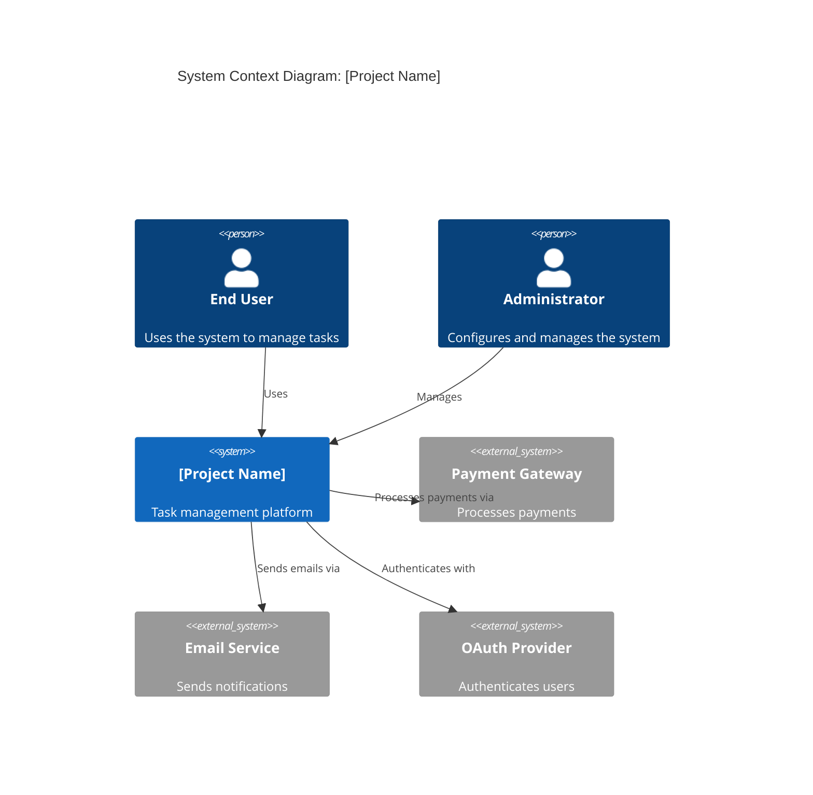

# Software Requirements Specification (SRS)

**Project**: [Project Name]
**Version**: 1.0
**Date**: [Date]
**Author**: [Author Name]
**Status**: Draft | In Review | Approved

---

## Document Approval

| Role | Name | Signature | Date |
|------|------|-----------|------|
| Project Manager | | | |
| Technical Lead | | | |
| Product Owner | | | |
| QA Lead | | | |

---

## Revision History

| Version | Date | Author | Description of Changes |
|---------|------|--------|------------------------|
| 0.1 | [Date] | [Author] | Initial draft |
| 1.0 | [Date] | [Author] | First approved version |

---

## Table of Contents

1. [Introduction](#1-introduction)
   - 1.1 [Purpose](#11-purpose)
   - 1.2 [Scope](#12-scope)
   - 1.3 [Definitions, Acronyms, and Abbreviations](#13-definitions-acronyms-and-abbreviations)
   - 1.4 [References](#14-references)
   - 1.5 [Overview](#15-overview)
2. [Overall Description](#2-overall-description)
   - 2.1 [Product Perspective](#21-product-perspective)
   - 2.2 [Product Functions](#22-product-functions)
   - 2.3 [User Classes and Characteristics](#23-user-classes-and-characteristics)
   - 2.4 [Operating Environment](#24-operating-environment)
   - 2.5 [Design and Implementation Constraints](#25-design-and-implementation-constraints)
   - 2.6 [Assumptions and Dependencies](#26-assumptions-and-dependencies)
3. [System Features](#3-system-features)
4. [External Interface Requirements](#4-external-interface-requirements)
   - 4.1 [User Interfaces](#41-user-interfaces)
   - 4.2 [Hardware Interfaces](#42-hardware-interfaces)
   - 4.3 [Software Interfaces](#43-software-interfaces)
   - 4.4 [Communications Interfaces](#44-communications-interfaces)
5. [Non-Functional Requirements](#5-non-functional-requirements)
   - 5.1 [Performance Requirements](#51-performance-requirements)
   - 5.2 [Safety Requirements](#52-safety-requirements)
   - 5.3 [Security Requirements](#53-security-requirements)
   - 5.4 [Software Quality Attributes](#54-software-quality-attributes)
6. [Other Requirements](#6-other-requirements)
7. [Appendix](#7-appendix)
   - 7.1 [Requirements Traceability Matrix](#71-requirements-traceability-matrix)
   - 7.2 [Use Case Diagrams](#72-use-case-diagrams)
   - 7.3 [System Context Diagram](#73-system-context-diagram)

---

## 1. Introduction

### 1.1 Purpose

This Software Requirements Specification (SRS) describes the functional and non-functional requirements for **[Project Name]**. This document is intended for:

- **Developers**: To understand what needs to be built
- **Testers**: To derive test cases and acceptance criteria
- **Project Managers**: To plan and track development
- **Stakeholders**: To review and approve requirements

### 1.2 Scope

**Product Name**: [Name]

**Product Description**: [Brief 2-3 sentence description of what the software does]

**Benefits**: [List key benefits]
- [Benefit 1]
- [Benefit 2]
- [Benefit 3]

**Goals**:
- [Goal 1: e.g., Reduce order processing time by 50%]
- [Goal 2: e.g., Improve user satisfaction scores by 20%]
- [Goal 3: e.g., Handle 10,000 concurrent users]

**Out of Scope**:
- [What this project will NOT include]
- [Feature or integration explicitly excluded]

### 1.3 Definitions, Acronyms, and Abbreviations

| Term | Definition |
|------|------------|
| API | Application Programming Interface |
| CRUD | Create, Read, Update, Delete |
| SaaS | Software as a Service |
| [Add more] | |

### 1.4 References

- [Document Title], [Author], [Date], [URL or location]
- [Standard or specification reference]
- [Related project documentation]

### 1.5 Overview

This SRS is organized as follows:
- **Section 2** provides an overall description of the product
- **Section 3** details specific system features and functional requirements
- **Section 4** describes external interface requirements
- **Section 5** specifies non-functional requirements
- **Section 6** covers additional requirements
- **Section 7** contains appendices with traceability matrices and diagrams

---

## 2. Overall Description

### 2.1 Product Perspective

[Describe how this product fits into a larger system or context]

**System Context:**
[Describe external systems, actors, and interfaces]

**System Context Diagram:**
[Insert C4 Level 1 or DFD Level 0 diagram here]

```
[User] --> [This System] --> [External API]
                |
                v
           [Database]
```

### 2.2 Product Functions

The system shall provide the following major functions:

1. **[Function Group 1: e.g., User Management]**
   - User registration and authentication
   - Profile management
   - Role-based access control

2. **[Function Group 2: e.g., Core Business Logic]**
   - [Core feature 1]
   - [Core feature 2]

3. **[Function Group 3: e.g., Reporting]**
   - [Reporting feature 1]
   - [Reporting feature 2]

### 2.3 User Classes and Characteristics

| User Class | Description | Technical Expertise | Frequency of Use |
|------------|-------------|---------------------|------------------|
| End User | [Description] | Low | Daily |
| Administrator | [Description] | Medium | Weekly |
| System Administrator | [Description] | High | As needed |

### 2.4 Operating Environment

**Hardware Platform**: [e.g., Cloud-based, minimum 4 vCPU, 16GB RAM]
**Operating System**: [e.g., Platform-independent (web-based)]
**Supported Browsers**: [e.g., Chrome 90+, Firefox 88+, Safari 14+, Edge 90+]
**Database**: [e.g., PostgreSQL 13+]
**Additional Software**: [e.g., Node.js 18+, Redis 6+]

### 2.5 Design and Implementation Constraints

- **Technical Constraints**:
  - Must use [specific technology stack]
  - Must integrate with [specific external system]

- **Business Constraints**:
  - Must comply with [regulation, e.g., GDPR, HIPAA]
  - Budget limitation: [amount]
  - Timeline: [date]

- **Regulatory Constraints**:
  - [Specific compliance requirements]

### 2.6 Assumptions and Dependencies

**Assumptions**:
- Users have reliable internet connectivity
- Users have modern web browsers
- [Other assumptions]

**Dependencies**:
- [External system or service name] availability
- Third-party API uptime (99.9% SLA)
- [Other dependencies]

---

## 3. System Features

### Feature 3.1: [Feature Name: e.g., User Authentication]

**Priority**: Must Have | Should Have | Could Have | Won't Have

**Description**:
[Detailed description of what this feature does and why it's needed]

**Stimulus/Response Sequences**:
1. User navigates to login page
2. User enters credentials
3. System validates credentials
4. System grants access if valid, or displays error if invalid

#### 3.1.1 Functional Requirements

**FR-AUTH-001**: User Login
- **Description**: The system shall allow users to log in using email and password.
- **Acceptance Criteria**:
  - **Given** a user has a registered account with email `user@example.com`
  - **When** the user enters the correct email and password
  - **Then** the system shall grant access and redirect to the dashboard
  - **And** a session token shall be generated (JWT)

- **Priority**: Must Have
- **Status**: ✅ Approved | ⏳ In Review | ❌ Not Started

**FR-AUTH-002**: User Logout
- **Description**: The system shall allow users to log out, invalidating their session.
- **Acceptance Criteria**:
  - **Given** a user is logged in
  - **When** the user clicks the "Logout" button
  - **Then** the system shall invalidate the session token
  - **And** redirect the user to the login page

- **Priority**: Must Have
- **Status**: ✅ Approved

**FR-AUTH-003**: Password Reset
- **Description**: The system shall allow users to reset their password via email.
- **Acceptance Criteria**:
  - **Given** a user has forgotten their password
  - **When** the user clicks "Forgot Password" and enters their email
  - **Then** the system shall send a password reset link to the email
  - **And** the link shall expire after 1 hour

- **Priority**: Should Have
- **Status**: ⏳ In Review

**FR-AUTH-004**: Multi-Factor Authentication (MFA)
- **Description**: The system shall support optional MFA using TOTP (e.g., Google Authenticator).
- **Acceptance Criteria**:
  - **Given** a user has enabled MFA in account settings
  - **When** the user logs in with valid credentials
  - **Then** the system shall prompt for a 6-digit TOTP code
  - **And** grant access only if the code is valid

- **Priority**: Should Have
- **Status**: ❌ Not Started

---

### Feature 3.2: [Feature Name: e.g., Task Management]

**Priority**: Must Have

**Description**:
[Detailed description of the task management feature]

#### 3.2.1 Functional Requirements

**FR-TASK-001**: Create Task
- **Description**: The system shall allow authorized users to create new tasks.
- **Acceptance Criteria**:
  - **Given** a user is logged in and has access to a project
  - **When** the user clicks "New Task" and fills in the form (title, description, due date)
  - **Then** the system shall save the task and assign it a unique ID
  - **And** display the task in the project's task list

- **Priority**: Must Have
- **Status**: ✅ Approved

**FR-TASK-002**: Assign Task
- **Description**: The system shall allow users to assign tasks to team members.
- **Acceptance Criteria**:
  - **Given** a task exists
  - **When** the user selects an assignee from the project member list
  - **Then** the system shall update the task's assignee field
  - **And** send a notification to the assigned user

- **Priority**: Must Have
- **Status**: ✅ Approved

**[Continue with more functional requirements for this feature...]**

---

## 4. External Interface Requirements

### 4.1 User Interfaces

**UI-001**: Web Interface
- The system shall provide a responsive web interface accessible on desktop and mobile browsers
- Minimum screen resolution: 1024x768 (desktop), 375x667 (mobile)
- Interface shall follow WCAG 2.1 AA accessibility standards

**UI-002**: Dashboard
- The system shall display a dashboard with:
  - Summary statistics
  - Recent activity feed
  - Quick action buttons

**Wireframes**:
[Insert wireframe diagrams or link to design files]

### 4.2 Hardware Interfaces

[If applicable, describe hardware interfaces such as printers, scanners, sensors, etc.]

- **HW-001**: [Hardware interface description]

### 4.3 Software Interfaces

**SI-001**: Payment Gateway Integration
- **System**: Stripe Payment API
- **Version**: v1 (2023-10-16)
- **Interface Type**: REST API over HTTPS
- **Data Format**: JSON
- **Purpose**: Process subscription payments

**SI-002**: Email Service Integration
- **System**: SendGrid Email API
- **Version**: v3
- **Interface Type**: REST API over HTTPS
- **Data Format**: JSON
- **Purpose**: Send transactional emails (verification, notifications)

**SI-003**: Database
- **System**: PostgreSQL
- **Version**: 15.x
- **Interface Type**: TCP/IP connection
- **Purpose**: Data persistence

### 4.4 Communications Interfaces

**CI-001**: HTTPS Protocol
- All API communication shall use HTTPS (TLS 1.2 or higher)
- Port: 443

**CI-002**: WebSocket Protocol
- Real-time updates shall use WebSocket (WSS)
- Port: 443

---

## 5. Non-Functional Requirements

### 5.1 Performance Requirements

**NFR-PERF-001**: Response Time
- 95% of API requests shall respond within 500ms under normal load
- 99% of API requests shall respond within 1000ms under normal load

**NFR-PERF-002**: Throughput
- The system shall support at least 1,000 concurrent active users
- The system shall handle at least 10,000 API requests per minute

**NFR-PERF-003**: Database Query Performance
- 95% of database queries shall complete within 100ms

**NFR-PERF-004**: Page Load Time
- Initial page load shall complete within 3 seconds on a standard broadband connection

### 5.2 Safety Requirements

**NFR-SAFE-001**: Data Backup
- The system shall perform automated backups daily at 2:00 AM UTC
- Backups shall be retained for 30 days

**NFR-SAFE-002**: Failover
- The system shall have automatic failover capability with <5 minutes downtime

### 5.3 Security Requirements

**NFR-SEC-001**: Authentication
- The system shall use JWT (JSON Web Tokens) for stateless authentication
- JWT tokens shall expire after 24 hours

**NFR-SEC-002**: Authorization
- The system shall implement role-based access control (RBAC)
- Unauthorized access attempts shall be logged

**NFR-SEC-003**: Data Encryption
- All sensitive data shall be encrypted at rest using AES-256
- All data in transit shall use TLS 1.2 or higher

**NFR-SEC-004**: Password Policy
- Passwords shall be at least 8 characters long
- Passwords shall contain at least one uppercase, one lowercase, one number, and one special character
- Passwords shall be hashed using bcrypt with a minimum cost factor of 10

**NFR-SEC-005**: Audit Logging
- The system shall log all security-relevant events (login attempts, permission changes, data modifications)
- Logs shall be tamper-evident and retained for 1 year

**NFR-SEC-006**: Compliance
- The system shall comply with GDPR for EU user data
- The system shall comply with [other relevant standards: PCI-DSS, HIPAA, SOC 2]

### 5.4 Software Quality Attributes

**NFR-QUAL-001**: Availability
- The system shall have 99.9% uptime (measured monthly)
- Planned maintenance windows excluded from uptime calculation

**NFR-QUAL-002**: Maintainability
- Code shall have at least 80% test coverage
- Code shall follow [specific style guide: e.g., Airbnb JavaScript Style Guide]

**NFR-QUAL-003**: Scalability
- The system shall scale horizontally to support increased load
- Database shall support read replicas for horizontal scaling

**NFR-QUAL-004**: Usability
- New users shall be able to complete core tasks within 5 minutes of first login
- The system shall provide contextual help and tooltips

**NFR-QUAL-005**: Portability
- The application shall be platform-independent (web-based)
- The application shall support internationalization (i18n) with English as the default locale

**NFR-QUAL-006**: Reliability
- Mean Time Between Failures (MTBF) shall be at least 720 hours (30 days)
- Mean Time To Recovery (MTTR) shall be less than 1 hour

---

## 6. Other Requirements

### Legal and Compliance

**REQ-LEGAL-001**: Terms of Service
- Users shall accept Terms of Service before using the system

**REQ-LEGAL-002**: Privacy Policy
- The system shall have a privacy policy compliant with GDPR and CCPA

### Installation and Deployment

**REQ-DEPLOY-001**: Deployment Environment
- The system shall be deployed on AWS (or specified cloud provider)
- Infrastructure shall be defined as code using [Pulumi/Terraform/CDK]

### Documentation

**REQ-DOC-001**: User Documentation
- The system shall include comprehensive user documentation (user guide, KB articles)

**REQ-DOC-002**: API Documentation
- The system shall include complete API documentation (OpenAPI specification)

**REQ-DOC-003**: Administrator Documentation
- The system shall include administrator documentation (deployment, configuration, troubleshooting)

---

## 7. Appendix

### 7.1 Requirements Traceability Matrix

| Requirement ID | Description | Design Component | Test Case | Priority | Status |
|----------------|-------------|------------------|-----------|----------|--------|
| FR-AUTH-001 | User login | AuthController | TC-AUTH-001 | Must Have | ✅ Approved |
| FR-AUTH-002 | User logout | AuthController | TC-AUTH-002 | Must Have | ✅ Approved |
| FR-AUTH-003 | Password reset | PasswordResetService | TC-AUTH-003 | Should Have | ⏳ In Review |
| FR-TASK-001 | Create task | TaskService | TC-TASK-001 | Must Have | ✅ Approved |
| FR-TASK-002 | Assign task | TaskService | TC-TASK-002 | Must Have | ✅ Approved |
| NFR-PERF-001 | Response time <500ms | - | TC-PERF-001 | Must Have | ✅ Approved |
| NFR-SEC-001 | JWT authentication | AuthMiddleware | TC-SEC-001 | Must Have | ✅ Approved |

### 7.2 Use Case Diagrams

[Insert UML Use Case Diagrams here]



### 7.3 System Context Diagram

[Insert C4 Level 1 System Context Diagram]



---

**End of Software Requirements Specification**

**Approval Signatures:**

___________________________
[Name], Project Manager
Date: ___________

___________________________
[Name], Technical Lead
Date: ___________

___________________________
[Name], Product Owner
Date: ___________

---

*This document is a living artifact and should be updated as requirements evolve. All changes must be reviewed and approved through the formal change control process.*
